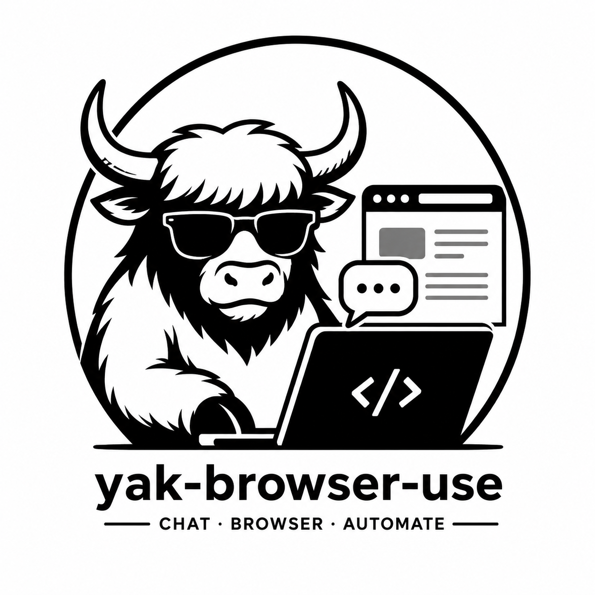

<p align="center">
  <picture>
    <source media="(prefers-color-scheme: dark)" srcset="logo.png">
    
  </picture>
</p>

<h1 align="center">Yak Browser-Use</h1>

<p align="center">
  <strong>CHAT · BROWSER · AUTOMATE</strong>
</p>

<p align="center">
  <em>一个让 AI Agent 跟你聊天同时操控浏览器的自动化框架</em>
</p>

<p align="center">
  
  
  
  
  
  
  
  
  
  
  <a href="./README.md"></a>
</p>
<p align="center">
  <a href="./README.md">English</a> · <a href="./README.zh-CN.md">简体中文</a>
</p>

---

## 项目简介

**yak-browser-use**（简称 **ybu**）是一个面向浏览器自动化的 AI Agent 框架。核心交互模型：

> **你跟 Agent 聊天 → Agent 自主操控浏览器 → 实时同步给你看**

支持两种模式：

- **Chat 模式** — 自然语言对话式操控，Agent 边聊边操作浏览器
- **Preset 模式** — 预设 Pipeline 回放，Agent 按编排步骤自动执行

技术底座基于 [Playwright](https://playwright.dev/) `connect_over_cdp()` 和 OpenAI-compatible LLM 客户端。

> **从零构建。** ybu 是一个独立的代码库，拥有自己的对话循环、渐进式快照引擎、CDP 集成和 Pipeline 编译器——全部为本项目独立设计和实现。代码无 browser-use 依赖，也不与其他浏览器自动化框架共享代码。

---

## 特性总览

| # | 特性 | 为什么重要 |
|---|------|-----------|
| 1 | **跨 Tab 隔离的实时 DOM 高亮** — 双层覆盖层（容器 + 浮动高亮块），RAF 节流重绘，MutationObserver 轻量增量更新。后台定时守卫线程防止跨 tab 不同步。每个 tab 保有独立高亮状态。 | 大多数浏览器 AI 工具要么没有实时高亮，要么用内联样式——滚动就崩、跨 tab 就串。Ybu 的高亮经受了真实业务压力测试——导航、滚动、SPA 切换后仍然稳定。 |
| 2 | **三种快照策略适配不同页面类型** — `aria`（Playwright aria_snapshot(mode="ai")，YAML 语义树，LLM 最省 token）适合快速概览；`a11y`（CDP Accessibility.getFullAXTree，结构化元素，含 ref/selector 支持 click/fill）适合可操作交互；`progressive`（密度自适应 DOM 遍历，≤200 元素，折叠密集容器，`expand_branch` 按需展开）适合复杂长页面。LLM 自动选择最合适的策略，不需要你操心。 | 单一快照策略在不同页面类型（SPA、iframe 密集、锁定 DOM）上各自失败。三种策略最大化覆盖率，LLM 不需要理解页面结构细节——只管选对模式就行。 |
| 3 | **渐进式快照的密度自适应折叠** — 不是简单的截断。遍历器深度优先读文档，每层测量容器密度，折叠超过阈值的内容，展平后通过 `expand_branch` 句柄让 LLM 按需展开。 | 其他框架截断 N 个元素后直接丢掉剩余内容。Ybu 的折叠-展开机制让 LLM 看到页面全貌，然后只深入感兴趣的区域，不浪费 token 在模板代码上。 |
| 4 | **Pipeline 是副产品** — 不需要预先定义 Pipeline。先聊天，后录制。`pipeline.yaml` 是聊天过程的录制产物，不是设计的起点。有用的流程保留下来后续回放。 | 降低使用门槛：不需要规划自动化流程，只管跟 Agent 聊天，它替你写。Pipeline 设计从真实交互中涌现，而不是前期写死。 |
| 5 | **共享存储的双语法模板解析** — `{path}`（全值引用，保留类型）+ `${path}`（内联字符串插值，`$` 前缀消歧义避免跟 JSON 花括号打架）。刻意设计的两个独立语法，不是无心不一致。 | 在不同工具间传递整个数据结构（`{step_3}`），或在 URL 和模板里插值（`https://${host}/api`）。每种语法有清晰的语义和失败模式。 |
| 6 | **Scratchpad 承载重数据** — HTML 源码、截图 base64、元素列表存入内存缓存。LLM 看到摘要，通过 `browser_source(cached=true)` 或 `browser_lookup_selector(@e5)` 按需获取细节。 | 保持 LLM 上下文窗口清洁的同时不丢弃数据。Agent 根据需要决定需要什么细节，而不是预先猜测。 |
| 7 | **read_data — 统一渐进式数据读取** — `read_data` 是文件内容读取的**唯一入口**。支持渐进式披露（offset/limit）、格式转换（`convert_to="csv"`）和二进制文件处理。`file_read` 目前仅返回元信息。 | 之前文件读取分散在 `file_read`、`file_read_head` 和 eval agent 中。统一工具让数据读取一致、可预期，并内置格式转换。 |
| 8 | **三步 Pipeline 与程序化检查** — Pipeline 步骤为 `goal → ops → check`，其中 `check` 支持 `url_contains`、`element_exists`、`text_contains`、`element_visible` — 确定性程序化验收，不依赖 LLM 判断。 | 多数 Pipeline 框架把验收留给 LLM。Ybu 的程序化检查快速、确定、独立于 LLM 成本/延迟——一个简单的检查不需要调用模型。 |
| 9 | **结构化错误恢复生态** — `error_classifier`（错误分类）→ `retry_utils`（可配退避）→ `turn_context`（轮次重试计数器），辅以 `error_recovery` 系统提示词引导。全链路打通，不是临时 try/except。 | 真实浏览器自动化持续失败（超时、元素找不到、CDP 断连）。结构化的恢复链路让 Agent 在真实世界的混乱中存活下来，而不是把错误砸用户脸上。 |
| 10 | **审核门控 + 熔断器 + 补偿回滚** — 三层安全生命周期。Guardian 对敏感操作要求人工审批，熔断器防止连续失败级联扩散，补偿机制支持变更回滚。 | 浏览器自动化会搞坏东西。安全生命周期意味着破坏性操作需要审批、连续失败不会级联、回滚是可行的——不只是"哦豁"。 |
| 11 | **Chat + 浏览器同步与流式 LLM** — 用户输入指令 → Agent 操作浏览器 → 推理过程、文本增量、工具调用结果全部通过 WebSocket 实时流式推送 | 无需配置文件、无需脚本。用自然语言就能驱动浏览器。看到 Agent 边思考边工作，而不是只看到最终结果。 |
| 12 | **丰富浏览器工具集** — 23 个浏览器原子操作（goto、click、fill、snapshot、scroll、eval、hover、tab…）覆盖日常自动化 | 足够全面应对真实任务，又足够精细实现精确控制。 |
| 13 | **自定义工具脚本** — 通过 ToolRegistry 热加载 Python 脚本；内置验证码、文件 IO、格式转换 | 不修改核心代码即可扩展 Agent 能力。丢进一个脚本，它就工作。 |
| 14 | **Electron 桌面 + Web UI** — React + Vite + Monaco 编辑器前端（支持 Diff 编辑器）；FastAPI 后端提供 REST 端点、WebSocket 事件流和静态前端。支持 Electron 桌面应用或 `uvx yak-browser-use` 一键浏览器 UI。 | 一个 IDE 级环境用于编写和调试自动化流程，内置 API 可对接任何前端或 CI pipeline。一行命令启动 Web 模式，无需 Electron 即可快速演示。 |
| 15 | **连接健康检测与会话持久化** — CDP 心跳 + 进程监控 + 自动断线处理；每个 Pipeline 独立 session 目录保存完整对话历史 | 让长时间运行的自动化在网络抖动和浏览器重启后仍保持在线。再也不丢上下文——重启后从上一次的地方继续。 |
| 16 | **下载目录按 Pipeline 隔离** — 每个 Pipeline 拥有独立的 `downloads/` 目录。 `browser_wait_for_download()` 等待文件下载完成， `read_data` 处理下载结果并支持格式转换。 | 下载隔离防止文件在工作空间之间冲突。 Agent 可在单一决定性流程中触发下载、等待、读取和转换结果。 |
| 17 | **Provider 灵活配置** — 支持 DeepSeek / OpenAI / 任意 OpenAI-compatible 提供商，平铺 JSON 配置 | 用你想用的模型，不是我们替你选的。 |
| 18 | **Pipeline 工具统一** — `pipeline_view` 替代 `pipeline_load`/`pipeline_list`，合并列表+详情查看。 `pipeline_add_step` 替代 `record_step` 用于步骤录制。 | 更少的工具需要学习，一致的命名，单一的 Pipeline 状态检视入口。 |
---

## 快速上手

### 一行命令（无需安装）

```bash
uvx yak-browser-use web
```

直接在浏览器中打开 Web UI — 零配置。首次运行会自动下载安装依赖。

### 前置要求

| 依赖 | 版本 | 安装 |
|------|------|------|
| Python | ≥ 3.12 | [python.org](https://python.org) |
| [uv](https://docs.astral.sh/uv/) | ≥ 0.4 | `powershell -c "irm https://astral.sh/uv/install.ps1 \| iex"` |
| Node.js | ≥ 18 | [nodejs.org](https://nodejs.org) |
| Chrome / Chromium | ≥ 120 | 已安装的 Chrome，或 `uv run playwright install chromium` |

> `uvx` 直接从 PyPI 启动 — 本地不需要 Python/Node.js 环境。

### 安装

```bash
# Windows 一键安装
install.bat

# 或手动三步
cd backend
uv sync                              # 安装 Python 依赖
uv run playwright install chromium   # 安装 Playwright Chromium
cd ../electron
npm install                          # 安装 Electron 前端依赖
```

### 启动

```bash
# 最快方式 — 从 PyPI 启动 Web UI（本地无需安装）
uvx yak-browser-use web

# 或本地安装后：
cd backend
uv run python -m yak_browser_use web        # Web UI（浏览器）
uv run python -m yak_browser_use serve       # REST API 服务
uv run python -m yak_browser_use --help      # 所有 CLI 命令

# Electron 桌面端（需要 Node.js）
cd electron
npm run electron:dev
```

### 配置 Provider

创建 `userdata/provider.json`（或在 Electron 设置面板 → LLM Provider 中配置）：

```json
{
  "model": "deepseek-chat",
  "api_key": "sk-xxx...xxxx",
  "api_base": "https://api.deepseek.com"
}
```

---

## 命令参考

```text
ybu run <path>                执行 pipeline.yaml
ybu serve [--port PORT]       启动 REST API 服务
ybu web                       启动 Web UI（浏览器，无需 Electron）
ybu logs [-f] [--source all]  查看统一日志
```

> CLI 命令：`serve`、`run`、`web`、`logs`。配置通过 Web UI / Electron 设置面板进行，不是 CLI 子命令。

---

## 架构说明

### 两层架构

```
┌─────────────────────────────────────────────────────┐
│                   编排层                             │
│  conversation_loop → LLM 决策 → tool_executor 执行   │
│  chat 模式 / preset 模式 / 错误恢复            │
└──────────────────┬──────────────────────────────────┘
                   │
┌──────────────────▼──────────────────────────────────┐
│                 CDP 浏览器控制层                       │
│  PlaywrightBridge → connect_over_cdp() → Chrome      │
│  CDPHelpers / ToolContext / ToolCDPHelpers           │
└─────────────────────────────────────────────────────┘
```

### 两种运行模式

#### Chat 模式（交互式）

```
POST /api/chat { message: "打开百度搜咖啡" }
  └→ service.process_chat_message()
       └→ run_conversation_loop()
            ├→ 加载 chat/system.md + pipeline 上下文
            ├→ LLM 调用（browser_* / goal_run / todo / skill / expand_branch）
            ├→ LLM 返回工具调用 → tool_executor（带 shared_store）
            │     ├→ browser_goto  → ops.py → PlaywrightBridge.goto()
            │     ├→ browser_click → ops.py → PlaywrightBridge.click()
            │     ├→ browser_snapshot → progressive/a11y/raw 快照
            │     └→ pipeline_add_step → 写入 pipeline.yaml
            └→ LLM 返回文本 → 结束本轮
```

**特点：**
- 用户看着浏览器画面发出指令，Agent 自主操作
- 流式 LLM 响应（推理过程 + 文本增量）实时推送
- WebSocket 事件流通知前端（turn_start / tool_start / text_chunk）
- Agent 通过 pipeline_add_step 自动记录操作步骤到 pipeline.yaml
- 工具间通过 shared_store 数据传递（`${}` 模板 / `_source_key`）

#### Preset 模式（预设回放）

```
POST /api/run { pipeline: "..." }
  └→ run_pipeline() / run_preset_loop()
       ├→ 加载已录制的 pipeline.yaml
       ├→ 将步骤列表送入 conversation_loop
       ├→ 系统提示 = build_system_prompt() + 步骤列表
       ├→ error_recovery.md 在 Agent 初始化时无条件加载
       ├→ LLM 看到完整步骤列表
       ├→ 用 browser_* 工具逐条执行步骤
       ├→ shared_store 透传支持数据流
       └→ 通过 error_recovery.md 提示词 + 重试工具引导错误恢复
```

**特点：**
- 可重复执行的自动化流程
- Pipeline 三步设计：**goal**（目标描述）→ **ops**（浏览器操作列表）→ **check**（程序化验收）
- check 支持 `url_contains` / `element_exists` / `text_contains` / `element_visible` 验收
- Pipeline 上下文注入系统提示，Agent 感知工作空间

---

## 项目结构

```
| yak-browser-use/
| ├── backend/
| │   ├── pyproject.toml              # 项目配置 + 依赖
| │   ├── src/
| │   │   └── yak_browser_use/        # 全部 Python 源码 ★
| │   │       ├── __main__.py         # CLI 入口（run/serve/web/logs）
| │   │       │
| │   │       ├── api/                # FastAPI REST + WebSocket 接口
| │   │       │   ├── routes.py       # 路由注册
| │   │       │   ├── service.py      # 业务逻辑
| │   │       │   ├── server.py       # 服务器生命周期
| │   │       │   └── state.py / errors.py
| │   │       │
| │   │       ├── engine/             # 核心执行引擎 ★
| │   │       │   ├── agent.py        # Agent 入口 + 流式 LLM
| │   │       │   ├── runner.py       # Chat 模式 runner
| │   │       │   ├── runner_preset.py# Preset 模式 orchestrator
| │   │       │   ├── executor.py     # Pipeline 包装执行器
| │   │       │   ├── ops.py          # 浏览器操作分发
| │   │       │   ├── scratchpad.py / step_machine.py
| │   │       │   ├── delivery.py / events.py
| │   │       │   ├── _param_resolver.py
| │   │       │   │
| │   │       │   ├── _harness/       # Conversation loop ★
| │   │       │   │   ├── conversation_loop.py
| │   │       │   │   ├── tools.py / tool_executor.py
| │   │       │   │   ├── pipeline_tools.py / pipeline_events.py
| │   │       │   │   ├── iteration_budget.py / turn_context.py
| │   │       │   │   ├── tool_guardrails.py / error_classifier.py
| │   │       │   │   ├── retry_utils.py / skill_tools.py
| │   │       │   │
| │   │       │   └── _lifecycle/     # Pipeline 生命周期
| │   │       │       ├── guardian.py    # 审核门控 + 熔断器
| │   │       │       └── compensation.py# 回滚/撤销
| │   │       │
| │   │       ├── cdp/                # Chrome DevTools Protocol ★
| │   │       │   ├── playwright_bridge.py  # 统一驱动
| │   │       │   ├── helpers.py / protocols.py
| │   │       │   ├── profiles.py / session.py
| │   │       │   ├── discover.py / launcher.py
| │   │       │
| │   │       ├── compiler/           # Pipeline 编译
| │   │       │   ├── models.py / schema.py / parser.py
| │   │       │   ├── graph.py / resolver.py / prepare.py
| │   │       │   ├── diff.py / generator.py / step_type.py
| │   │       │
| │   │       ├── tools/              # 工具注册（41 工具）
| │   │       │   ├── registry.py     # 集中调度
| │   │       │   ├── adapters.py / captcha.py
| │   │       │   ├── file_read.py / file_write.py / format_convert.py
| │   │       │   ├── read_data.py    # 统一渐进式数据读取
| │   │       │   ├── extract.py / data.py
| │   │       │   ├── todo.py / todo_store.py
| │   │       │   ├── edit_pipeline.py
| │   │       │   └── _path_utils.py
| │   │       │
| │   │       ├── llm/                # LLM 客户端
| │   │       ├── prompts/            # Prompt 模板（Markdown）
| │   │       ├── params/             # 持久化参数管理
| │   │       ├── workspace/          # 工作区管理
| │   │       ├── cli/                # CLI 命令
| │   │       ├── utils/              # 工具函数
| │   │       │   └── _path.py        # project_root() 路径解析器
| │   │       └── static/             # Web UI 前端（构建产物）
| │   │
| │   ├── tests/                      # 800+ 单元 & 集成测试
| │   ├── README.md                   # 英文文档
| │   └── uv.lock                     # 依赖锁文件
| │
| ├── electron/                       # Electron 桌面前端
| │   ├── src/renderer/               # React + Vite + Monaco Editor
| │   ├── vite.web.config.ts          # Web 构建配置 → backend static/
| │   └── package.json
| │
| ├── .github/workflows/              # CI/CD 自动化
| │   ├── ci.yml                      # 推送/PR 自动测试
| │   └── release.yml                 # Tag/手动发版
| │
| ├── logo.png / install.bat / run.bat
| └── README.md / README.zh-CN.md
```

---

## 核心设计原则

1. **PlaywrightBridge 统一驱动** — 所有浏览器操作通过 PlaywrightBridge (`connect_over_cdp()`)，获得 auto-wait / auto-scroll / auto-retry，外加健康检测心跳、子进程监控、断连处理和 SSRF 防护。`BrowserBridge` 协议（`cdp/protocols.py`）定义了接口契约。

2. **文件即契约** — pipeline.yaml 是静态契约，编译阶段严格校验（DAG 环检测、文件引用校验），运行时尽量减少意外。

3. **不含 sub-agent 架构** — 主 LLM 通过 `todo`、`goal_run` 和 `browser_*` 工具直接处理所有任务——不涉及 sub-agent 的创建、调度或上下文管理。复杂步骤被拆分为主 LLM 自行执行的子任务，上下文集中在同一位置，避免了 agent 间交接的开销。Sub-agent 曾经过原型验证，因 YAGNI 被移除。

---

## 开发

```bash
# 创建并激活虚拟环境
cd backend
uv venv
source .venv/bin/activate   # Linux/macOS
.venv\Scripts\activate      # Windows

# 安装开发依赖
uv sync --dev

# 运行测试
uv run pytest

# 测试覆盖率
uv run pytest --cov=.

# 打开 Chrome 远程调试端口
chrome.exe --remote-debugging-port=9222
```

### 常用开发命令

| 命令 | 说明 |
|------|------|
| `uv run python -m yak_browser_use serve --port 8080` | 启动 API 服务 |
| `uv run python -m yak_browser_use web` | 启动 Web UI（浏览器） |
| `uv run python -m yak_browser_use run path/to/pipeline.yaml` | 执行 Pipeline |
| `uv run python -m yak_browser_use logs -f` | 实时查看日志 |
| `uv run python -m yak_browser_use --help` | 查看全部命令 |
| `cd electron && npm run electron:dev` | 启动 Electron 前端 |
| `cd electron && npm run dev:web` | 启动 Web 前端开发服务器（Vite HMR + 代理） |

---

## 架构文档

完整架构详解（数据流图、设计原则、执行路径）请见 [`docs/architecture-overview.md`](docs/architecture-overview.md)。

---

## 许可证

MIT © 2026 Yak Browser-Use Contributors

项目参考及贡献者鸣谢请见 [`ACKNOWLEDGMENTS.md`](ACKNOWLEDGMENTS.md)。

---

<p align="center">
  
  <br/>
  <sub>Built with yak power · Chat · Browser · Automate</sub>
</p>
